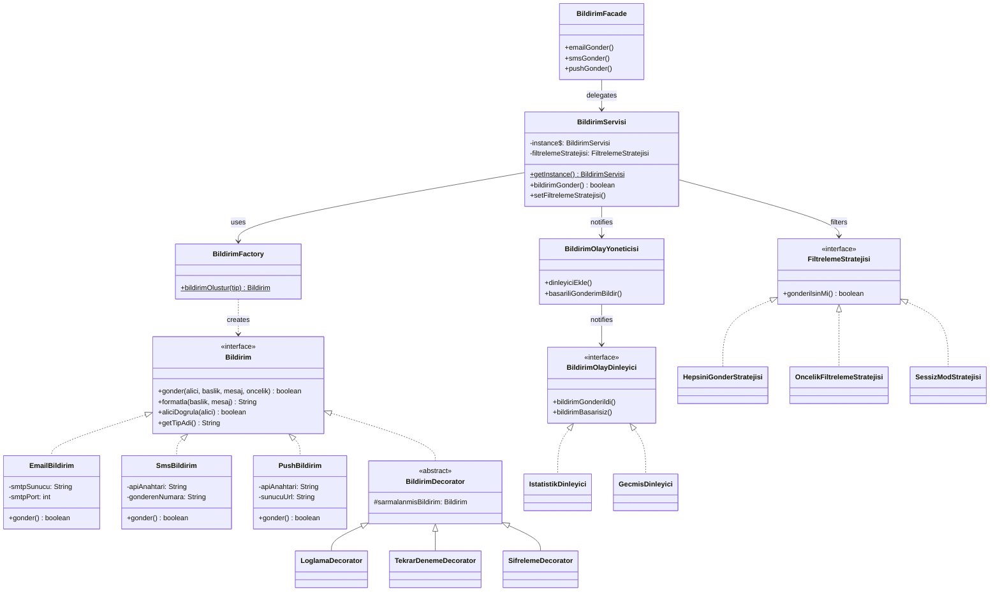

# Bildirim Sistemi — Evrimleşen Sistem Ödevi

## Konu Seçimi: A — Bildirim Sistemi

**Gerekçe:** Bildirim Sistemi konusunu seçtim çünkü gerçek dünya uygulamalarında bildirim yönetimi çok yaygın bir ihtiyaçtır. E-posta, SMS ve push bildirimlerinin tek bir sınıfta yönetilmesi, tasarım örüntülerinin neden gerekli olduğunu somut bir şekilde gösterir. Ayrıca bu konu, Creational, Structural ve Behavioral örüntülerinin üçünü de doğal olarak uygulamaya uygundur.

---

## Projenin Ne Yaptığı

Bir bildirim sistemi simülasyonu. E-posta, SMS ve Push bildirimlerini:
- **Oluşturur** (Factory Method)
- **Tek merkezden yönetir** (Singleton)
- **Davranış ekler** — loglama, şifreleme, retry (Decorator)
- **Basit API sunar** (Facade)
- **Olay bazlı izler** — istatistik, geçmiş (Observer)
- **Runtime'da filtreler** — öncelik filtresi, sessiz mod (Strategy)

---

## Kullanılan Tasarım Örüntüleri

| # | Örüntü | Kategori | Açıklama |
|---|--------|----------|----------|
| 1 | **Factory Method** | Creational | Bildirim nesnelerini merkezi factory ile oluşturma |
| 2 | **Singleton** | Creational | BildirimServisi için tek instance garantisi |
| 3 | **Decorator** | Structural | Loglama, retry, şifreleme davranışlarını katmanlama |
| 4 | **Facade** | Structural | Karmaşık alt sisteme basit API sunma |
| 5 | **Observer** | Behavioral | Bildirim olaylarını dinleyicilere dağıtma |
| 6 | **Strategy** | Behavioral | Runtime'da değiştirilebilir filtreleme algoritmaları |

---

## Mimari Diyagram



---

## Nasıl Çalıştırılır

### Gereksinimler
- Java JDK 21+
- Git

### Derleme ve Çalıştırma
```bash
# Derleme
javac -encoding UTF-8 -d out src/*.java

# Çalıştırma
java -cp out Main
```

### Proje Yapısı
```
BildirimSistemi/
├── README.md                  ← Bu dosya
├── PATTERNS.md               ← Tüm örüntülerin belgelenmesi
├── PROBLEMS.md               ← Başlangıç kodu analizi (Faz 0)
├── src/
│   ├── Bildirim.java         ← Bildirim arayüzü
│   ├── EmailBildirim.java    ← E-posta implementasyonu
│   ├── SmsBildirim.java      ← SMS implementasyonu
│   ├── PushBildirim.java     ← Push implementasyonu
│   ├── BildirimTipi.java     ← Bildirim tipi enum
│   ├── BildirimFactory.java  ← Factory Method
│   ├── BildirimServisi.java  ← Singleton + orkestrasyon
│   ├── BildirimDecorator.java      ← Decorator base
│   ├── LoglamaDecorator.java       ← Loglama decorator
│   ├── TekrarDenemeDecorator.java   ← Retry decorator
│   ├── SifrelemeDecorator.java      ← Şifreleme decorator
│   ├── BildirimFacade.java          ← Facade
│   ├── BildirimOlayDinleyici.java   ← Observer interface
│   ├── BildirimOlayYoneticisi.java  ← Observer subject
│   ├── IstatistikDinleyici.java     ← İstatistik observer
│   ├── GecmisDinleyici.java         ← Geçmiş observer
│   ├── FiltrelemeStratejisi.java    ← Strategy interface
│   ├── HepsiniGonderStratejisi.java       ← Filtre: hepsini gönder
│   ├── OncelikFiltrelemeStratejisi.java   ← Filtre: öncelik bazlı
│   ├── SessizModStratejisi.java           ← Filtre: sessiz mod
│   └── Main.java                    ← Demo uygulaması
├── docs/
│   ├── diagrams/              ← UML diyagramları
│   └── ai-log/
│       ├── phase1.md          ← Faz 1 AI kullanım logu
│       ├── phase2.md          ← Faz 2 AI kullanım logu
│       └── phase3.md          ← Faz 3 AI kullanım logu
└── .github/workflows/ci.yml  ← GitHub Actions CI
```

### Branch Yapısı
- `main` → temiz, merge edilmiş son durum
- `phase-1` → Creational örüntüler (Factory Method, Singleton)
- `phase-2` → Structural örüntüler (Decorator, Facade)
- `phase-3` → Behavioral örüntüler (Observer, Strategy)

---

## Teknolojiler
- **Dil:** Java 21 (Microsoft OpenJDK)
- **CI:** GitHub Actions
- **VCS:** Git & GitHub
