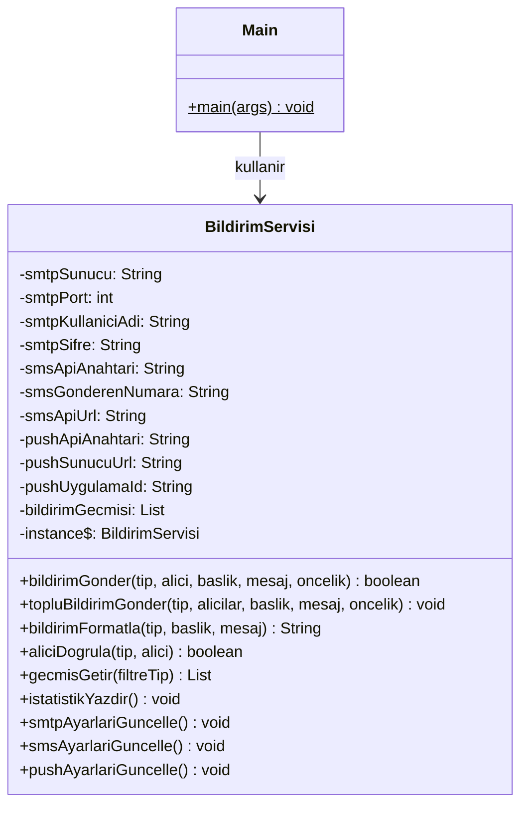

# UML Sınıf Diyagramı — Faz 0 (Başlangıç)

Tüm sorumluluklar tek bir God Class'ta:

**Sorunlar:**
- Tek sınıfta 3 farklı bildirim tipi, 10+ alan, 10+ metot
- Tüm bildirim mantığı if-else zincirleriyle ayrılıyor
- SRP, OCP, DRY ihlalleri
