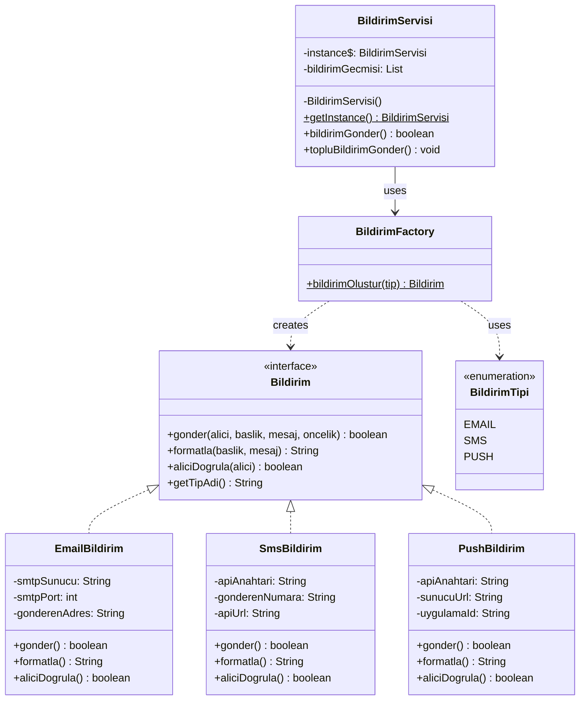

# UML Sınıf Diyagramı — Faz 1 (Creational)

Factory Method + Singleton uygulandıktan sonra:

**Kazanımlar:**
- Her bildirim tipi kendi sınıfında (SRP)
- Factory Method ile merkezi nesne yaratma
- Singleton ile tek instance garantisi
- If-else zincirleri polimorfizm ile kaldırıldı
