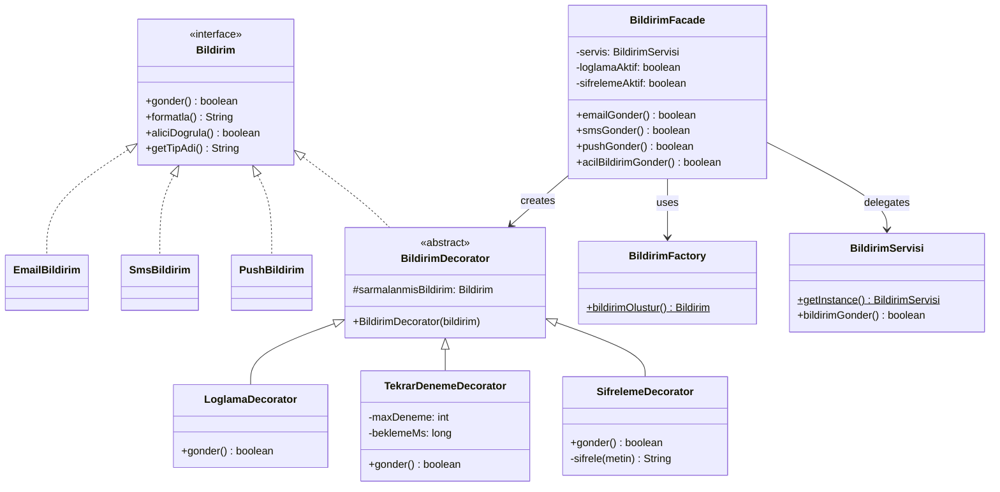

# UML Sınıf Diyagramı — Faz 2 (Structural)

Decorator + Facade uygulandıktan sonra:

**Kazanımlar:**
- Decorator ile davranışlar katmanlanabilir (Log + Şifreleme + Retry)
- Facade ile karmaşık alt sistem tek satırla kullanılabilir
- Mevcut sınıflar hiç değişmedi (OCP)
