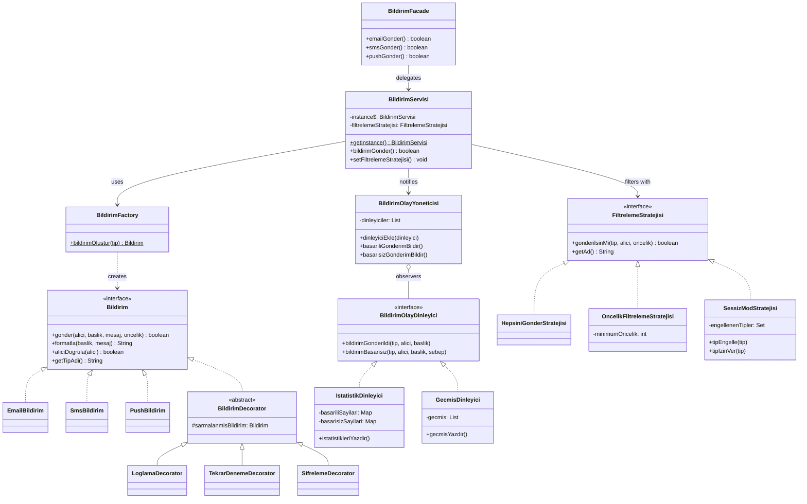

# UML Sınıf Diyagramı — Faz 3 (Behavioral) — Final

Tüm 6 örüntü uygulandıktan sonra:

**Final Mimari — 6 Örüntü:**
1. **Factory Method** → BildirimFactory creates Bildirim
2. **Singleton** → BildirimServisi.getInstance()
3. **Decorator** → BildirimDecorator chain
4. **Facade** → BildirimFacade simplifies API
5. **Observer** → BildirimOlayYoneticisi notifies listeners
6. **Strategy** → FiltrelemeStratejisi swappable at runtime
